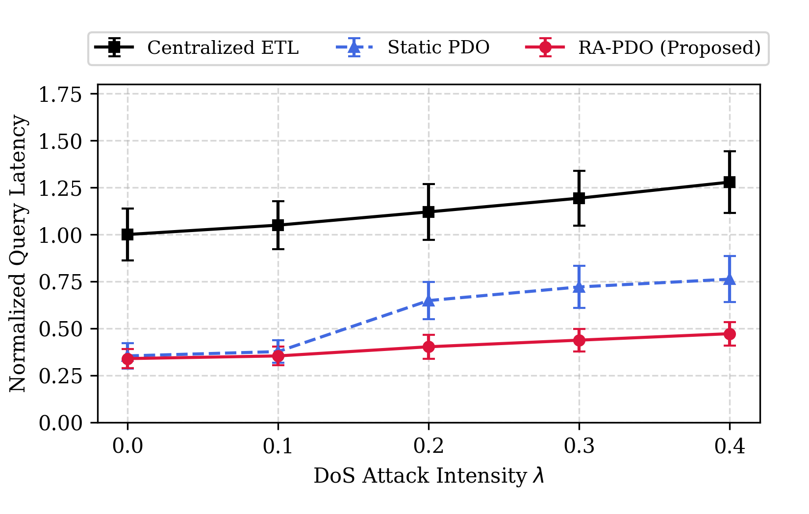
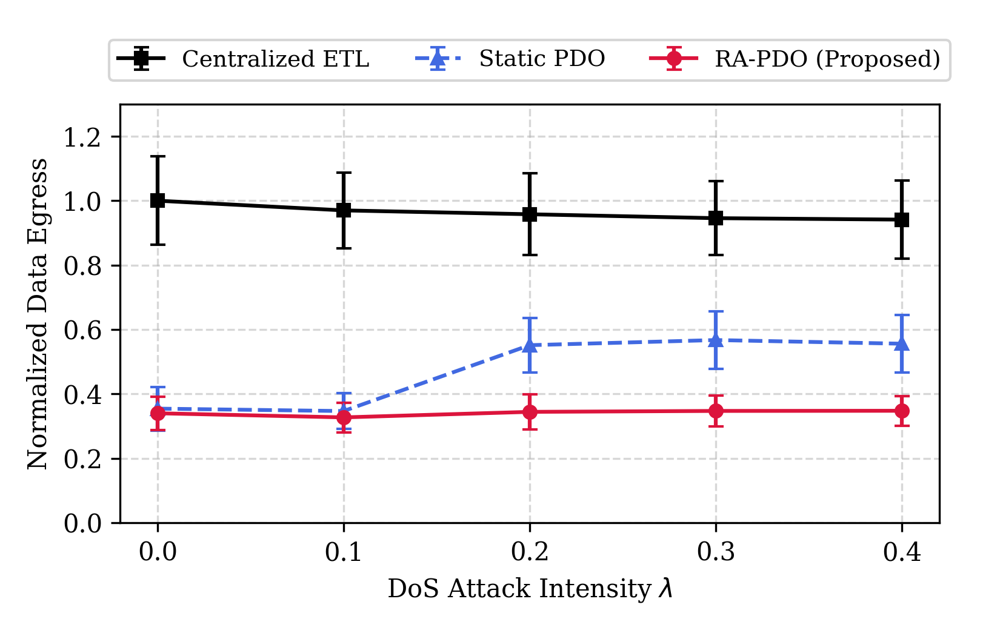

# RA-PDO: Resilience-Aware Push-Down Optimization

Discrete-event simulation for **RA-PDO** (Resilience-Aware Push-Down Optimization) in multi-cloud data integration pipelines under adversarial network conditions.

## Overview

This repository contains the simulation code and generated figures for the RA-PDO paper. The simulation compares three query execution strategies under varying DoS attack intensities:

- **Centralized ETL** — No push-down; all data is transferred to a central orchestrator.
- **Static PDO** — Push-down to a fixed engine with no adaptive rerouting.
- **RA-PDO (Proposed)** — Resilience-aware push-down with adaptive rerouting based on real-time link reliability estimates.

## Figures

### Fig. 1: Normalized Query Latency vs. DoS Attack Intensity



### Fig. 2: Normalized Cross-Cloud Data Egress vs. DoS Attack Intensity



## Requirements

- Python 3.8+
- NumPy
- Matplotlib

Install dependencies:

```bash
pip install numpy matplotlib
```

## Usage

Run the simulation:

```bash
python simulation.py
```

This will:

1. Execute 30 trials × 100 queries × 5 λ values × 3 methods.
2. Print the pipeline availability table (Table I) to stdout.
3. Generate `fig_latency.png` and `fig_egress.png` at 300 DPI.

## Simulation Parameters

| Parameter | Value | Description |
|-----------|-------|-------------|
| `N_ENGINES` | 6 | 3 clouds × 2 engines each |
| `N_QUERIES` | 100 | Queries per trial |
| `N_TRIALS` | 30 | Independent repetitions |
| `BETA` | 1.0 | Link vulnerability coefficient |
| `RHO_MIN` | 0.85 | Minimum acceptable link reliability |
| `L_MAX_MS` | 500 ms | SLA latency ceiling |
| `LAMBDAS` | 0.0 – 0.4 | DoS attack intensity range |

## Repository Structure

```
├── simulation.py       # Main simulation and plotting code
├── fig_latency.png     # Generated latency figure
├── fig_latency.pdf     # Generated latency figure (PDF)
├── fig_egress.png      # Generated egress figure
├── fig_egress.pdf      # Generated egress figure (PDF)
└── README.md           # This file
```

## License

This project is provided for academic and research purposes.
